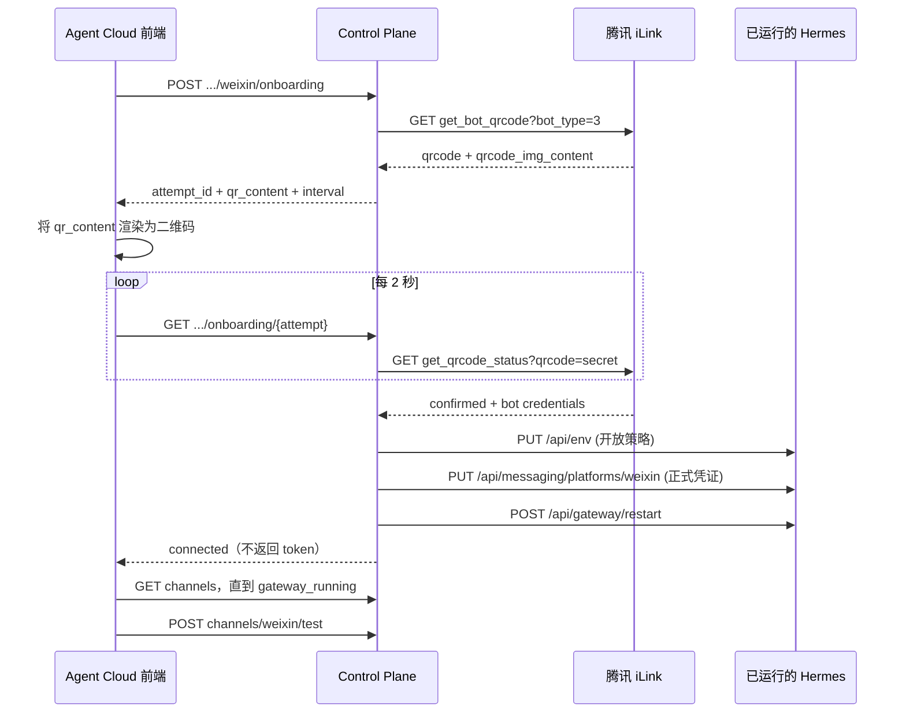

# Agent Cloud 的 Weixin 扫码绑定实现

## 结论

Agent Cloud 当前实现对应“场景 2”的一个可运行版本，但不是把预生成 URL 注入 Hermes：**Hermes Agent 必须先达到 `ready`，随后 Control Plane 向腾讯 iLink 申请临时二维码并轮询；确认后，Control Plane 把正式凭证写入该 Agent 已运行的 Hermes Dashboard，再重启 Gateway 并验证连接。**

## 1. API 与访问前提

三个 onboarding 路由分别负责开始、查询和取消；另有渠道列表、测试和断开接口（[api.go:76](/Users/sandyzhou/codex-project/agent-cloud/controlplane/api.go:76)，[api.go:95](/Users/sandyzhou/codex-project/agent-cloud/controlplane/api.go:95)）。所有操作先校验当前用户拥有该 Agent，并要求 `ActualState == ready`，因此它不是“Hermes 启动前绑定”，而是“运行后热配置”（[channels.go:59](/Users/sandyzhou/codex-project/agent-cloud/controlplane/channels.go:59)）。

前端 API 契约只包含二维码内容、attempt ID、过期时间、轮询间隔，以及 `waiting / scanned / connected / expired` 状态；没有凭证字段（[api.ts:145](/Users/sandyzhou/codex-project/agent-cloud-frontend/src/api.ts:145)）。请求使用登录 Cookie，非 2xx 被转换成带后端错误码的 `APIError`（[api.ts:266](/Users/sandyzhou/codex-project/agent-cloud-frontend/src/api.ts:266)）。

## 2. 二维码生成与临时数据

Control Plane 直接调用默认 `https://ilinkai.weixin.qq.com/ilink/bot/get_bot_qrcode?bot_type=3`，携带 `iLink-App-Id: bot` 和固定 ClientVersion。它把响应 `qrcode` 保存成只供后端轮询的 `Secret`，把 `qrcode_img_content`（缺失时退回 `qrcode`）作为 `qr_content` 返回浏览器，Weixin 默认轮询间隔 2 秒、attempt 本地有效期 10 分钟（[channels.go:18](/Users/sandyzhou/codex-project/agent-cloud/controlplane/channels.go:18)，[channels.go:285](/Users/sandyzhou/codex-project/agent-cloud/controlplane/channels.go:285)）。测试明确断言 secret poll token 不得出现在创建响应中（[channels_test.go:92](/Users/sandyzhou/codex-project/agent-cloud/controlplane/channels_test.go:92)）。

`channelOnboardingAttempt` 只存在 Control Plane 进程内的 mutex-protected map，字段包括 user/agent/channel 归属、Secret、二维码内容、provider base、过期时间和并发轮询锁；它没有数据库模型（[channels.go:22](/Users/sandyzhou/codex-project/agent-cloud/controlplane/channels.go:22)，[controlplane.go:25](/Users/sandyzhou/codex-project/agent-cloud/controlplane/controlplane.go:25)）。同一用户、Agent、channel 新建 attempt 时会删掉旧 attempt 和所有已过期项（[channels.go:273](/Users/sandyzhou/codex-project/agent-cloud/controlplane/channels.go:273)）。

浏览器收到 `qr_content` 后，使用 `qrcode` 包本地生成 320px Data URL；微信按钮与调用入口在 [App.tsx:1922](/Users/sandyzhou/codex-project/agent-cloud-frontend/src/App.tsx:1922)，生成逻辑在 [App.tsx:1663](/Users/sandyzhou/codex-project/agent-cloud-frontend/src/App.tsx:1663)，弹窗提示这是独立 iLink Bot、主要用于私聊（[App.tsx:2181](/Users/sandyzhou/codex-project/agent-cloud-frontend/src/App.tsx:2181)）。

## 3. 状态轮询与凭证取得

前端采用后端返回的间隔且强制最少 2 秒，调用 onboarding GET（[App.tsx:1506](/Users/sandyzhou/codex-project/agent-cloud-frontend/src/App.tsx:1506)）。后端校验 attempt 的 user、agent、channel 三重归属，并用 `Polling` 拒绝同一 attempt 的并发查询（[channels.go:341](/Users/sandyzhou/codex-project/agent-cloud/controlplane/channels.go:341)）。

后端以 secret 请求 `get_qrcode_status`。状态映射为：`scaned`/`scaned_but_redirect` → `scanned`，`expired` → `expired`，其他未确认状态 → `waiting`。若 iLink 要求 redirect，则后续轮询切到新 host；host 必须是 HTTPS、无端口/用户信息/query/fragment，且为 `weixin.qq.com` 或其子域，以防 SSRF（[channels.go:417](/Users/sandyzhou/codex-project/agent-cloud/controlplane/channels.go:417)，[channels.go:574](/Users/sandyzhou/codex-project/agent-cloud/controlplane/channels.go:574)）。

只有 `confirmed` 才读取 `ilink_bot_id`、`bot_token`、`baseurl` 和 `ilink_user_id`。缺少 bot ID、token 或扫码用户 ID 都视为失败；返回给配置层的是 `WEIXIN_ACCOUNT_ID`、`WEIXIN_TOKEN`、`WEIXIN_BASE_URL`，返回浏览器的 identity 只有 account/user ID，没有 token（[channels.go:444](/Users/sandyzhou/codex-project/agent-cloud/controlplane/channels.go:444)）。

## 4. 凭证存储与 Hermes 注入

正式凭证**不写 Agent Cloud 业务数据库，也不写 Kubernetes Deployment env**。Control Plane 通过该 Agent Kubernetes Service 的 dashboard 端口和 `hermes-runtime` Secret 中的 bearer token，直接调用 Hermes Dashboard（[channels.go:81](/Users/sandyzhou/codex-project/agent-cloud/controlplane/channels.go:81)，[kubernetes_runtime.go:90](/Users/sandyzhou/codex-project/agent-cloud/controlplane/kubernetes_runtime.go:90)）。

写入分三步：

1. `PUT /api/env` 分别设置 `WEIXIN_DM_POLICY=open` 与 `WEIXIN_ALLOW_ALL_USERS=true`；
2. `PUT /api/messaging/platforms/weixin`，body 为 `enabled: true` 和三个正式凭证；
3. `POST /api/gateway/restart`。

实现见 [channels.go:186](/Users/sandyzhou/codex-project/agent-cloud/controlplane/channels.go:186)。这意味着凭证的最终持久化语义由所钉住的 Hermes Dashboard API 负责。Hermes 的 `/opt/data` 挂载 `workspace` PVC，因此 Dashboard 写入其数据目录的配置可以跨 Pod 重建保留（[agent_runtime.go:238](/Users/sandyzhou/codex-project/agent-cloud/controlplane/agent_runtime.go:238)，[agent_runtime.go:359](/Users/sandyzhou/codex-project/agent-cloud/controlplane/agent_runtime.go:359)，[agent_runtime.go:442](/Users/sandyzhou/codex-project/agent-cloud/controlplane/agent_runtime.go:442)）。但 Agent Cloud 源码本身没有对 Weixin token 做数据库/Kubernetes Secret 级托管；应把“PVC 上的 Hermes 配置”视作当前凭证归属边界。

容器创建时确实预置了开放 DM 策略，但没有预置扫码所得账号/token；同一容器以 `gateway run` 启动（[agent_runtime.go:218](/Users/sandyzhou/codex-project/agent-cloud/controlplane/agent_runtime.go:218)，[agent_runtime.go:333](/Users/sandyzhou/codex-project/agent-cloud/controlplane/agent_runtime.go:333)）。因此扫码绑定不触发 Deployment 更新或 Pod 重建，只重启 Hermes Gateway 进程。扫码成功后 attempt 被删除（[channels.go:386](/Users/sandyzhou/codex-project/agent-cloud/controlplane/channels.go:386)）。

## 5. 前端激活与验证

收到 `connected` 后，前端关闭二维码弹窗并进入 `restarting`；随后每 3 秒刷新 channels、最多等待 60 秒。看到 `gateway_running` 后调用渠道 test；验证成功才在 UI 标记 connected（[App.tsx:1565](/Users/sandyzhou/codex-project/agent-cloud-frontend/src/App.tsx:1565)）。这比“配置请求成功即显示连接成功”更可靠。扫码轮询遇到 `onboarding_poll_in_progress` 或临时上游失败会继续重试（[App.tsx:1531](/Users/sandyzhou/codex-project/agent-cloud-frontend/src/App.tsx:1531)）。关闭弹窗会 DELETE attempt，后端删除操作对不存在的 attempt 返回 204（[App.tsx:1680](/Users/sandyzhou/codex-project/agent-cloud-frontend/src/App.tsx:1680)，[channels.go:493](/Users/sandyzhou/codex-project/agent-cloud/controlplane/channels.go:493)）。

## 6. 对前述两个场景的回答

- **场景 1（Hermes 运行前扫码）：当前 Agent Cloud 不支持。** API 明确要求 Agent `ready`，凭证写入目标是一个已经能访问的 Hermes Dashboard。
- **场景 2（先启动 Hermes、后扫码）：支持，但实现与“预生成 URL 注入”不同。** 正确流程是 Agent ready 后即时创建短期 attempt；Control Plane 持有二维码轮询 secret；确认后才把最终 credentials 写给 Hermes 并重启 Gateway。无需、也不能把二维码 URL 当作 Hermes channel 配置。

## 7. 生产风险与改进建议

1. **attempt 是单进程内存态。** Control Plane 重启会全部丢失；多副本下 start 与 poll 落到不同实例会 404。生产应放入带 TTL 的 Redis/数据库，或至少做 sticky routing；`Polling` 应改成分布式锁。
2. **10 分钟超时不是 provider 真实过期时间。** Weixin attempt 固定本地 TTL，未读取上游 expiry；应在前端明确过期并提供刷新。
3. **前端 expired 处理有缺陷。** 它会把 state 存为 `expired`，但弹窗只特判 `scanned/retrying`，所以仍显示“等待扫码”并继续轮询，下一次因后端已删除 attempt 而报错（[App.tsx:1521](/Users/sandyzhou/codex-project/agent-cloud-frontend/src/App.tsx:1521)，[App.tsx:2202](/Users/sandyzhou/codex-project/agent-cloud-frontend/src/App.tsx:2202)）。
4. **关闭/轮询竞态。** close 主动 DELETE，effect cleanup 也 DELETE；后端删除基本幂等，但已在途 GET 没有 AbortSignal，关闭后仍可能返回 connected 并触发激活。
5. **配置提交不是事务。** 两次 `/api/env`、platform PUT、gateway restart 任一步失败会留下部分配置；重试通常可收敛，但应增加幂等 finalize 状态和补偿/审计。
6. **凭证安全边界需明确。** `bot_token` 不经过浏览器是正确的，但目前落到 Hermes/PVC，而不是 Kubernetes Secret 或集中密钥服务。需要确认 Hermes 写盘权限、备份加密、日志脱敏和删除语义；断开只清三个 credential keys（[channels.go:223](/Users/sandyzhou/codex-project/agent-cloud/controlplane/channels.go:223)）。
7. **默认开放给所有私聊用户。** 当前明确设置 `open + allow_all`，不是只允许扫码用户；尽管取得了 `ilink_user_id`，它没有用于 allowlist。这是产品策略而非技术必需，私人 Agent 上线前应重新评估。
8. **服务重启语义。** 后端已经完成 restart 才返回 connected，前端再轮询和 test；如果响应在成功写入后丢失，客户端会认为失败但渠道可能已经启用。应让 finalize 可查询、可重复。

## 验证

在 `agent-cloud` 当前提交 `e3993d059bd3ba770885927fbd02d38e919e6704` 上运行了 Weixin onboarding、host allowlist 与首次轮询相关 Go 测试，均通过。两个仓库均只读，未修改业务代码。
